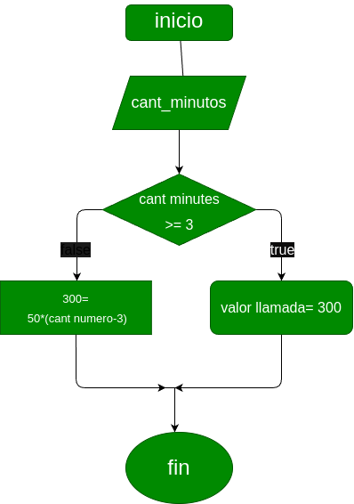

# Condicionales_1
## Costo de una llamada telefonica

ingresar el tiempo de duracion de una llamada telefonica y determinar la cantidad a pagar, de acuerdo a lo siguente:

- Toda llamana que dure 3 minutos o menos tiene un costo de $300 pesos.
- Cada minuto adicional cuesta $50 pesos.

# analisis
  ## imput
  ### variable de entrada
  **cant_numero**: valor a ingrsar(<=)
  ### processing 
  if cant_number es menor que 3
  volor a pagar $300
  else cant_number es mayor a 4 
  300=
 50*(cant numero-3)

  ### output
  valor llamada
# diseño

# construccion

